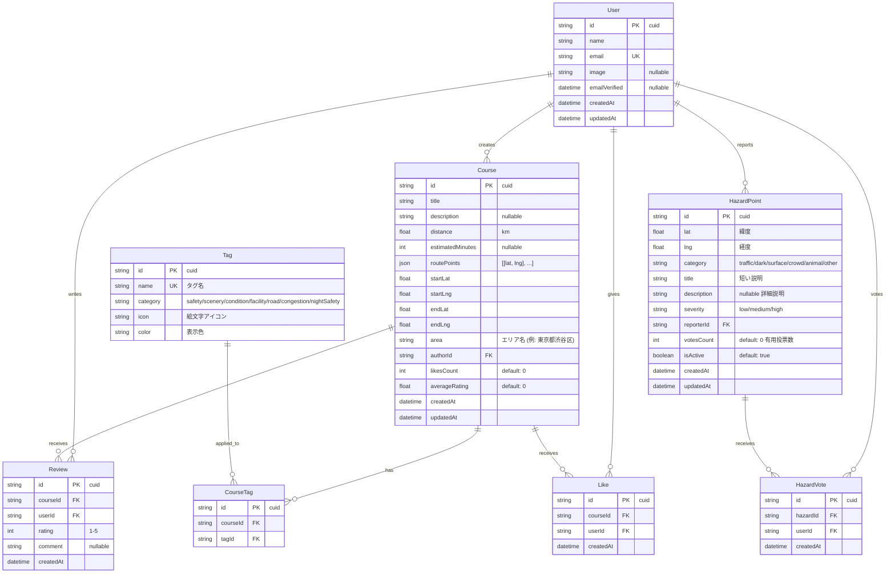
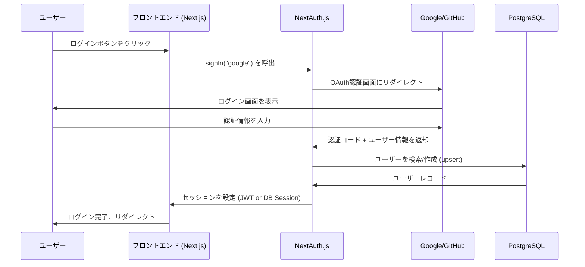

# 🏃 RunShare 設計書

> データ駆動型・実用情報重視のランニングコース共有プラットフォーム── ランナーの日常に寄り添う「実用版Runtrip」

---

## 📋 目次

1. [プロジェクト概要](#プロジェクト概要)
2. [技術スタック](#技術スタック)
3. [ディレクトリ構成](#ディレクトリ構成)
4. [データモデル（DB設計）](#データモデルdb設計)
5. [タグシステム設計](#タグシステム設計)
6. [ページ仕様](#ページ仕様)
7. [API エンドポイント設計](#api-エンドポイント設計)
8. [認証フロー](#認証フロー)
9. [開発ロードマップ](#開発ロードマップ)
10. [役割分担](#役割分担)

---

## プロジェクト概要

| 項目 | 内容 |
|---|---|
| **アプリ名** | RunShare |
| **コンセプト** | 「実用版Runtrip」── ランナーの日常に寄り添う、データ駆動型・実用情報重視のコース共有プラットフォーム |
| **差別化ポイント** | Runtripが「おしゃれ・旅ラン・エモい体験」を重視するのに対し、本アプリは「信号の数」「歩道の幅」「夜間の安全性」「路面の種類」などの**実用データ**と、「ここは危ない」「この道は暗い」などの**ネガティブ情報（ハザード）**を積極的に共有する |
| **ターゲット** | 日本の日常ランナー（初心者〜中級者）。毎日の通勤圏・自宅周辺で快適に走りたい人 |
| **UI言語** | 日本語 |
| **UIテーマ** | ライトモード、緑系アクセント（自然・ランニングのイメージ） |

### 主要機能

| 機能 | 概要 |
|---|---|
| **ハザードポイント投稿** | コースとは別に、地図上の「地点（点）」に対してハザード（危険・注意スポット）情報をピン投稿できる。カテゴリ: 交通危険 / 暗い道 / 路面悪化 / 歩行者混雑 / 動物注意 / その他 |
| **距離逆引き検索（即決UX）** | 「今日は何km走りたい？」を起点とした検索UI。[3km] [5km] [7km] [10km] ボタン + 現在地 → 近くのルートが即表示 |
| **POIオーバーレイ表示（Lv.1）** | コース作成時に、Overpass API経由で周辺のコンビニ・トイレ・銭湯等を地図上に自動表示。ユーザーはそれを見ながらルートを手動で描ける |
| **拡張タグシステム** | 信号の数・歩道の幅・路面の種類・混雑度・夜間安全度などの実用データタグを付与可能 |

---

## 技術スタック

| レイヤー | 技術 | 学べるスキル |
|---|---|---|
| **フレームワーク** | Next.js 15 (App Router) | React, SSR/SSG, ファイルベースルーティング, Server Components |
| **言語** | TypeScript | 型安全な開発、インターフェース設計 |
| **ORM** | Prisma | スキーマ定義、マイグレーション、型付きDBクエリ |
| **データベース** | PostgreSQL | リレーショナルDB、SQL、地理空間データ (PostGIS) |
| **認証** | NextAuth.js (Auth.js v5) | OAuth、セッション管理、JWT |
| **地図** | Leaflet + OpenStreetMap + Overpass API | GIS、座標系、地理空間データの可視化、POI取得 |
| **スタイリング** | CSS Modules | コンポーネントスコープのCSS、BEM的な設計 |
| **バリデーション** | Zod | スキーマベースのバリデーション |

---

## ディレクトリ構成

```
RunningRouteSharingService/
├── prisma/
│   ├── schema.prisma          # DBスキーマ定義
│   ├── seed.ts                # シードデータ
│   └── migrations/            # マイグレーションファイル
├── public/
│   └── images/                # 静的画像
├── src/
│   ├── app/                   # Next.js App Router
│   │   ├── layout.tsx         # ルートレイアウト
│   │   ├── page.tsx           # トップページ（距離逆引き検索 + コース一覧）
│   │   ├── globals.css        # グローバルCSS（デザインシステム）
│   │   ├── auth/
│   │   │   ├── login/
│   │   │   │   └── page.tsx   # ログインページ
│   │   │   └── register/
│   │   │       └── page.tsx   # 登録ページ
│   │   ├── courses/
│   │   │   ├── page.tsx       # コース一覧・検索ページ
│   │   │   ├── new/
│   │   │   │   └── page.tsx   # コース作成ページ（POIオーバーレイ付き）
│   │   │   └── [id]/
│   │   │       └── page.tsx   # コース詳細ページ（ハザード表示付き）
│   │   ├── hazards/
│   │   │   ├── page.tsx       # ハザードマップページ（一覧・閲覧）
│   │   │   └── new/
│   │   │       └── page.tsx   # ハザードポイント投稿ページ
│   │   └── api/               # API Routes (Route Handlers)
│   │       ├── auth/
│   │       │   └── [...nextauth]/
│   │       │       └── route.ts   # NextAuth設定
│   │       ├── courses/
│   │       │   ├── route.ts       # GET（一覧）, POST（作成）
│   │       │   └── [id]/
│   │       │       ├── route.ts   # GET（詳細）, PUT（更新）, DELETE（削除）
│   │       │       ├── like/
│   │       │       │   └── route.ts   # POST（いいね）, DELETE（いいね取消）
│   │       │       └── reviews/
│   │       │           └── route.ts   # GET（レビュー一覧）, POST（レビュー投稿）
│   │       ├── hazards/
│   │       │   ├── route.ts       # GET（一覧・範囲検索）, POST（作成）
│   │       │   └── [id]/
│   │       │       ├── route.ts   # GET（詳細）, DELETE（削除）
│   │       │       └── vote/
│   │       │           └── route.ts   # POST（有用投票）, DELETE（投票取消）
│   │       └── poi/
│   │           └── route.ts       # GET（Overpass API経由のPOI取得）
│   ├── components/            # 共通UIコンポーネント
│   │   ├── layout/
│   │   │   ├── Header.tsx
│   │   │   ├── Header.module.css
│   │   │   ├── Footer.tsx
│   │   │   └── Footer.module.css
│   │   ├── map/
│   │   │   ├── MapView.tsx            # 地図表示（閲覧用）
│   │   │   ├── MapView.module.css
│   │   │   ├── MapEditor.tsx          # 地図エディタ（コース描画用）
│   │   │   ├── MapEditor.module.css
│   │   │   ├── GpsRecorder.tsx        # GPS記録コンポーネント
│   │   │   └── PoiOverlay.tsx         # POIオーバーレイ表示コンポーネント
│   │   ├── course/
│   │   │   ├── CourseCard.tsx          # コースカード（一覧用）
│   │   │   ├── CourseCard.module.css
│   │   │   ├── CourseDetail.tsx        # コース詳細
│   │   │   ├── CourseDetail.module.css
│   │   │   ├── TagSelector.tsx         # タグ選択UI
│   │   │   ├── TagSelector.module.css
│   │   │   ├── TagBadge.tsx            # タグバッジ表示
│   │   │   └── TagBadge.module.css
│   │   ├── hazard/
│   │   │   ├── HazardPin.tsx           # ハザードピン表示コンポーネント
│   │   │   ├── HazardPin.module.css
│   │   │   ├── HazardForm.tsx          # ハザード投稿フォーム
│   │   │   ├── HazardForm.module.css
│   │   │   ├── HazardList.tsx          # ハザード一覧表示
│   │   │   └── HazardList.module.css
│   │   ├── search/
│   │   │   ├── DistanceQuickSearch.tsx  # 距離逆引き検索UI
│   │   │   ├── DistanceQuickSearch.module.css
│   │   │   ├── SearchBar.tsx           # 検索バー
│   │   │   ├── SearchBar.module.css
│   │   │   ├── FilterPanel.tsx         # フィルタパネル
│   │   │   └── FilterPanel.module.css
│   │   └── ui/
│   │       ├── Button.tsx
│   │       ├── Button.module.css
│   │       ├── Input.tsx
│   │       ├── Input.module.css
│   │       ├── StarRating.tsx
│   │       └── StarRating.module.css
│   ├── lib/                   # ユーティリティ・設定
│   │   ├── prisma.ts          # Prismaクライアントのシングルトン
│   │   ├── auth.ts            # NextAuth設定
│   │   ├── overpass.ts        # Overpass API クライアント
│   │   └── constants.ts       # タグ定義、ハザードカテゴリ、定数
│   ├── models/                # データアクセス層（Model）
│   │   ├── course.ts          # コースの CRUD 操作
│   │   ├── user.ts            # ユーザー操作
│   │   ├── review.ts          # レビュー操作
│   │   ├── like.ts            # いいね操作
│   │   └── hazard.ts          # ハザードポイントの CRUD 操作
│   ├── services/              # ビジネスロジック層（Service）
│   │   ├── courseService.ts   # コース関連のビジネスロジック
│   │   ├── searchService.ts   # 検索・フィルタリングロジック
│   │   ├── reviewService.ts   # レビュー関連ロジック
│   │   ├── hazardService.ts   # ハザードポイント関連ロジック
│   │   └── poiService.ts     # POI取得ロジック（Overpass API連携）
│   └── types/                 # TypeScript型定義
│       ├── course.ts          # コース関連の型
│       ├── user.ts            # ユーザー関連の型
│       ├── tag.ts             # タグ関連の型
│       └── hazard.ts          # ハザード関連の型
├── .env                       # 環境変数
├── .env.example               # 環境変数テンプレート
├── next.config.ts             # Next.js設定
├── tsconfig.json              # TypeScript設定
├── package.json
└── README.md
```

> [!NOTE]
> **MVC的な層分離**: `models/`（データアクセス）→ `services/`（ビジネスロジック）→ `app/api/`（Route Handler = Controller）という構造で、MVC的な設計パターンを実践できます。

---

## データモデル（DB設計）



### Prisma スキーマ

```prisma
// prisma/schema.prisma

generator client {
  provider = "prisma-client-js"
}

datasource db {
  provider = "postgresql"
  url      = env("DATABASE_URL")
}

model User {
  id            String    @id @default(cuid())
  name          String?
  email         String    @unique
  emailVerified DateTime?
  image         String?
  createdAt     DateTime  @default(now())
  updatedAt     DateTime  @updatedAt

  // NextAuth.js 用
  accounts Account[]
  sessions Session[]

  // アプリ固有
  courses      Course[]
  reviews      Review[]
  likes        Like[]
  hazardPoints HazardPoint[]
  hazardVotes  HazardVote[]
}

// NextAuth.js 用テーブル
model Account {
  id                String  @id @default(cuid())
  userId            String
  type              String
  provider          String
  providerAccountId String
  refresh_token     String?
  access_token      String?
  expires_at        Int?
  token_type        String?
  scope             String?
  id_token          String?
  session_state     String?
  user              User    @relation(fields: [userId], references: [id], onDelete: Cascade)

  @@unique([provider, providerAccountId])
}

model Session {
  id           String   @id @default(cuid())
  sessionToken String   @unique
  userId       String
  expires      DateTime
  user         User     @relation(fields: [userId], references: [id], onDelete: Cascade)
}

model VerificationToken {
  identifier String
  token      String   @unique
  expires    DateTime

  @@unique([identifier, token])
}

model Course {
  id               String   @id @default(cuid())
  title            String
  description      String?
  distance         Float    // km
  estimatedMinutes Int?     // 推定所要時間（分）
  routePoints      Json     // [[lat, lng], [lat, lng], ...]
  startLat         Float
  startLng         Float
  endLat           Float
  endLng           Float
  area             String   // エリア名
  likesCount       Int      @default(0)
  averageRating    Float    @default(0)
  createdAt        DateTime @default(now())
  updatedAt        DateTime @updatedAt

  authorId String
  author   User   @relation(fields: [authorId], references: [id], onDelete: Cascade)

  tags    CourseTag[]
  reviews Review[]
  likes   Like[]

  @@index([area])
  @@index([authorId])
  @@index([distance])
}

model Tag {
  id       String @id @default(cuid())
  name     String @unique  // 例: "信号が少ない"
  category String          // "safety" | "scenery" | "condition" | "facility" | "road" | "congestion" | "nightSafety"
  icon     String          // 絵文字 例: "🚗"
  color    String          // CSS色 例: "#ef4444"

  courses CourseTag[]
}

model CourseTag {
  id       String @id @default(cuid())
  courseId  String
  tagId    String
  course   Course @relation(fields: [courseId], references: [id], onDelete: Cascade)
  tag      Tag    @relation(fields: [tagId], references: [id], onDelete: Cascade)

  @@unique([courseId, tagId])
}

model Review {
  id        String   @id @default(cuid())
  rating    Int      // 1-5
  comment   String?
  createdAt DateTime @default(now())

  courseId String
  userId  String
  course  Course @relation(fields: [courseId], references: [id], onDelete: Cascade)
  user    User   @relation(fields: [userId], references: [id], onDelete: Cascade)

  @@unique([courseId, userId])  // 1ユーザー1コースにつき1レビュー
  @@index([courseId])
}

model Like {
  id        String   @id @default(cuid())
  createdAt DateTime @default(now())

  courseId String
  userId  String
  course  Course @relation(fields: [courseId], references: [id], onDelete: Cascade)
  user    User   @relation(fields: [userId], references: [id], onDelete: Cascade)

  @@unique([courseId, userId])  // 1ユーザー1コースにつき1いいね
  @@index([courseId])
}

model HazardPoint {
  id          String   @id @default(cuid())
  lat         Float    // 緯度
  lng         Float    // 経度
  category    String   // "traffic" | "dark" | "surface" | "crowd" | "animal" | "other"
  title       String   // 短い説明 例: "右折車が多い交差点"
  description String?  // 詳細説明
  severity    String   @default("medium") // "low" | "medium" | "high"
  votesCount  Int      @default(0)        // 有用投票数
  isActive    Boolean  @default(true)     // 有効フラグ（古い情報を非活性化）
  createdAt   DateTime @default(now())
  updatedAt   DateTime @updatedAt

  reporterId String
  reporter   User   @relation(fields: [reporterId], references: [id], onDelete: Cascade)

  votes HazardVote[]

  @@index([lat, lng])
  @@index([category])
  @@index([reporterId])
}

model HazardVote {
  id        String   @id @default(cuid())
  createdAt DateTime @default(now())

  hazardId String
  userId   String
  hazard   HazardPoint @relation(fields: [hazardId], references: [id], onDelete: Cascade)
  user     User        @relation(fields: [userId], references: [id], onDelete: Cascade)

  @@unique([hazardId, userId])  // 1ユーザー1ハザードにつき1投票
  @@index([hazardId])
}
```

---

## タグシステム設計

### タグカテゴリとデフォルトタグ

タグはシードデータとしてDBに事前登録します。

#### 🛡️ 安全性 (safety)
| タグ名 | アイコン | 色 | 説明 |
|---|---|---|---|
| 車が多い | 🚗 | `#ef4444` (赤) | 交通量が多い道路を含む |
| 歩道が広い | 🛤️ | `#22c55e` (緑) | 広い歩道があり安全 |
| 信号が多い | 🚦 | `#f59e0b` (黄) | 信号が多く止まることが多い |
| 夜道が明るい | 💡 | `#a855f7` (紫) | 夜間でも街灯があり明るい |

#### 🌿 景観 (scenery)
| タグ名 | アイコン | 色 | 説明 |
|---|---|---|---|
| 景色がきれい | 🌅 | `#f97316` (オレンジ) | 景色の良いスポットがある |
| 自然が多い | 🌳 | `#16a34a` (緑) | 公園や緑地が多い |
| 川沿い | 🏞️ | `#0ea5e9` (水色) | 川沿いのコース |
| 海沿い | 🌊 | `#0284c7` (青) | 海沿いのコース |

#### 🏔️ コンディション (condition)
| タグ名 | アイコン | 色 | 説明 |
|---|---|---|---|
| 平坦 | ➡️ | `#6366f1` (インディゴ) | 高低差が少なく走りやすい |
| 坂が多い | ⛰️ | `#dc2626` (赤) | アップダウンが激しい |
| 未舗装 | 🏕️ | `#92400e` (茶) | 未舗装路を含む |
| トイレあり | 🚻 | `#2563eb` (青) | コース沿いにトイレがある |

#### 🏪 施設 (facility)
| タグ名 | アイコン | 色 | 説明 |
|---|---|---|---|
| コンビニ近く | 🏪 | `#059669` (緑) | コンビニが近くにある |
| 給水ポイントあり | 🚰 | `#0891b2` (シアン) | 給水できる場所がある |
| 駐車場あり | 🅿️ | `#4f46e5` (インディゴ) | 駐車場がある |

#### 🚦 信号の数 (trafficLight)
| タグ名 | アイコン | 色 | 説明 |
|---|---|---|---|
| 信号が少ない | 🟢 | `#22c55e` (緑) | ほぼノンストップで走れる |
| 信号が普通 | 🟡 | `#eab308` (黄) | 平均的な信号頻度 |
| 信号が多い（実用） | 🔴 | `#ef4444` (赤) | 頻繁に止まる必要がある |

#### 🛤️ 歩道の幅 (sidewalk)
| タグ名 | アイコン | 色 | 説明 |
|---|---|---|---|
| 歩道が狭い | ↔️ | `#f97316` (オレンジ) | すれ違いが難しい幅 |
| 歩道が普通 | ↔️ | `#6b7280` (グレー) | 一般的な歩道幅 |
| 歩道が広い（実用） | ↔️ | `#22c55e` (緑) | 余裕を持って走れる幅 |

#### 🛣️ 路面の種類 (surface)
| タグ名 | アイコン | 色 | 説明 |
|---|---|---|---|
| アスファルト | 🛣️ | `#6b7280` (グレー) | 舗装された一般道路 |
| 土 | 🟤 | `#92400e` (茶) | 土の道（トレイル含む） |
| 芝生 | 🌱 | `#16a34a` (緑) | 芝生の上を走るコース |
| 混合 | 🔀 | `#8b5cf6` (紫) | 複数の路面が混在 |

#### 👥 混雑度・時間帯別 (congestion)
| タグ名 | アイコン | 色 | 説明 |
|---|---|---|---|
| 朝空いている | 🌅 | `#22c55e` (緑) | 早朝は人が少ない |
| 昼混んでいる | ☀️ | `#f59e0b` (黄) | 日中は混雑しやすい |
| 夜空いている | 🌙 | `#6366f1` (インディゴ) | 夜間は人が少ない |
| 終日空いている | ✅ | `#10b981` (エメラルド) | 時間帯を問わず空いている |
| 週末混雑 | 📅 | `#ef4444` (赤) | 週末は混雑する |

#### 🔦 夜間安全度 (nightSafety)
| タグ名 | アイコン | 色 | 説明 |
|---|---|---|---|
| 街灯が多い | 💡 | `#22c55e` (緑) | 夜間でも十分な明るさ |
| 街灯が少ない | 🌑 | `#f59e0b` (黄) | 部分的に暗い箇所がある |
| 街灯がない | ⚫ | `#ef4444` (赤) | 夜間走行は非推奨 |

### ハザードカテゴリ

ハザードポイントは以下のカテゴリで分類します。

| カテゴリID | 名称 | アイコン | 色 | 説明 |
|---|---|---|---|---|
| `traffic` | 交通危険 | ⚠️ | `#ef4444` (赤) | 右折車が多い交差点、見通しの悪いカーブ等 |
| `dark` | 暗い道 | 🌑 | `#6366f1` (インディゴ) | 街灯がなく夜間危険な箇所 |
| `surface` | 路面悪化 | 🕳️ | `#f59e0b` (黄) | 穴、段差、水たまりが溜まりやすい箇所等 |
| `crowd` | 歩行者混雑 | 👥 | `#f97316` (オレンジ) | 通勤時間帯の駅前、観光地周辺等 |
| `animal` | 動物注意 | 🐗 | `#92400e` (茶) | 野生動物・野良犬等の出没エリア |
| `other` | その他 | ❗ | `#6b7280` (グレー) | 上記に該当しない注意情報 |

### タグの表示仕様

```
┌──────────────────────────┐
│ 🚗 車が多い              │  ← 赤背景、白文字
└──────────────────────────┘
│ 🌳 自然が多い            │  ← 緑背景、白文字
└──────────────────────────┘
│ 🟢 信号が少ない          │  ← 緑背景、白文字（実用タグ）
└──────────────────────────┘
```

- **バッジ形式**: アイコン + テキストをコンパクトに表示
- **色分け**: カテゴリごとに色系統を統一（安全性=暖色系、景観=自然色系、実用タグ=段階色 等）
- **選択UI**: チェックボックスグリッド（カテゴリ別にグルーピング）
- **実用タグの排他選択**: 同一カテゴリ内（例: 信号の数）はラジオボタン式（1つだけ選択可）

---

## ページ仕様

### 1. トップページ / コース一覧 (`/` および `/courses`)

```
┌────────────────────────────────────────────────┐
│  [Header: ロゴ | 検索 | ⚠️ハザード | ログイン]  │
├────────────────────────────────────────────────┤
│                                                │
│  🏃 今日は何km走りたい？                       │
│                                                │
│  [3km]  [5km]  [7km]  [10km]  [距離を入力]     │
│                                                │
│  📍 現在地から探す  |  エリア: [渋谷区 ▼]      │
│                                                │
│  ── 検索結果 ──────────────────────────         │
│                                                │
│  🔍 詳細フィルタ ▼                             │
│  ┌─ フィルタ展開時 ────────────────────┐       │
│  │ 距離: [4.5]km 〜 [5.5]km            │       │
│  │ タグ: 🟢信号少ない  🛣️アスファルト  │       │
│  │ ソート: [評価順 ▼]                   │       │
│  └──────────────────────────────────┘       │
│                                                │
│  ┌──────┐  ┌──────┐  ┌──────┐               │
│  │地図   │  │地図   │  │地図   │               │
│  │      │  │      │  │      │               │
│  │コース1│  │コース2│  │コース3│               │
│  │3.5km  │  │5.2km  │  │2.1km  │               │
│  │⭐4.2  │  │⭐3.8  │  │⭐4.7  │               │
│  │🟢🛤️  │  │🚗🌅  │  │🌳🏞️  │               │
│  │⚠️2件  │  │⚠️0件  │  │⚠️1件  │  ← 周辺ハザード数│
│  └──────┘  └──────┘  └──────┘               │
│                                                │
│  [もっと見る]                                   │
│                                                │
├────────────────────────────────────────────────┤
│  [Footer]                                      │
└────────────────────────────────────────────────┘
```

**機能:**
- **距離逆引き検索（メインUI）**: 距離ボタン（3km / 5km / 7km / 10km）をワンタップで選択 → 現在地付近のコースを即表示
- **距離範囲フィルタ**: 詳細フィルタ内でスライダーまたは入力フィールドで範囲指定（例: 4.5km〜5.5km）
- **現在地ベース検索**: Geolocation APIで現在地を取得し、近くのコースを優先表示
- キーワード検索（コース名、エリア名）
- タグでのフィルタリング（複数選択可）
- エリアでの絞り込み
- ソート（新着順、評価順、いいね順、距離順）
- コースカードに周辺ハザード数を表示
- レスポンシブ対応（モバイル: 1列、タブレット: 2列、PC: 3列）

### 2. コース詳細ページ (`/courses/[id]`)

```
┌────────────────────────────────────────────────┐
│  [Header]                                      │
├────────────────────────────────────────────────┤
│                                                │
│  コース名: 代々木公園ランニングコース           │
│  投稿者: ユーザー名 | 投稿日: 2025/01/15       │
│                                                │
│  ┌────────────────────────────────────────┐    │
│  │                                        │    │
│  │    地図（ルート表示 + ハザードピン）     │    │
│  │    ⚠️ = ハザードポイント                │    │
│  │    🟡 = 路面悪化  🔴 = 交通危険        │    │
│  │                                        │    │
│  └────────────────────────────────────────┘    │
│                                                │
│  📏 距離: 5.2km  ⏱️ 推定時間: 35分             │
│  📍 エリア: 東京都渋谷区                       │
│                                                │
│  タグ:                                         │
│  [🌳 自然が多い] [🛤️ 歩道が広い]              │
│  [➡️ 平坦] [🚻 トイレあり]                    │
│  [🟢 信号が少ない] [🛣️ アスファルト]          │
│  [💡 街灯が多い]                               │
│                                                │
│  ⚠️ 周辺のハザード (3件):                      │
│  ┌──────────────────────────────────────┐      │
│  │ 🔴 右折車が多い交差点 (高)  👍12     │      │
│  │ 🟡 段差注意 (中)            👍5      │      │
│  │ 🌑 街灯なし区間 (低)        👍3      │      │
│  └──────────────────────────────────────┘      │
│                                                │
│  💬 説明:                                      │
│  代々木公園を一周するコース。木陰が多く...       │
│                                                │
│  ❤️ いいね (24)  ⭐ 平均評価: 4.2 (12件)       │
│                                                │
│  ── レビュー ──                                │
│  ⭐⭐⭐⭐⭐ ユーザーA                          │
│  とても走りやすいコースでした！                  │
│                                                │
│  ⭐⭐⭐⭐☆ ユーザーB                          │
│  景色がきれいですが、週末は人が多い...           │
│                                                │
├────────────────────────────────────────────────┤
│  [Footer]                                      │
└────────────────────────────────────────────────┘
```

**機能:**
- Leafletマップでルートをポリラインとして表示
- **ハザードポイントの地図上表示**: ルート周辺（半径500m以内）のハザードポイントを自動取得し、カテゴリ別アイコンで地図上にピン表示
- **ハザード一覧**: 周辺ハザードのリスト表示（カテゴリ、深刻度、有用投票数）
- スタート/ゴール地点にマーカー表示
- コース情報（距離、推定時間、エリア）の表示
- タグバッジの表示（実用タグ含む）
- いいねボタン（ログイン必須）
- レビュー一覧の表示
- レビュー投稿フォーム（ログイン必須、星評価 + コメント）

### 3. コース作成ページ (`/courses/new`)

```
┌────────────────────────────────────────────────┐
│  [Header]                                      │
├────────────────────────────────────────────────┤
│                                                │
│  📝 新しいコースを作成                         │
│                                                │
│  [手動描画] [GPS記録] ← タブ切り替え           │
│                                                │
│  ┌────────────────────────────────────────┐    │
│  │                                        │    │
│  │    地図（クリックでルート描画）          │    │
│  │    🏪 = コンビニ  🚻 = トイレ          │    │
│  │    ♨️ = 銭湯     🚰 = 水飲み場         │    │
│  │    [元に戻す] [クリア]                  │    │
│  │                                        │    │
│  │    [☐ コンビニ表示] [☐ トイレ表示]     │    │
│  │    [☐ 銭湯表示]   [☐ 水飲み場表示]    │    │
│  │                                        │    │
│  └────────────────────────────────────────┘    │
│                                                │
│  📏 距離: 3.2km（自動計算）                    │
│                                                │
│  コース名: [________________]                  │
│  エリア:   [________________]                  │
│  説明:     [________________]                  │
│  推定時間: [____] 分                           │
│                                                │
│  🏷️ タグを選択:                                │
│  ┌─ 🛡️ 安全性 ──────────────────┐             │
│  │ ☐ 🚗車が多い  ☐ 🛤️歩道が広い │             │
│  │ ☐ 🚦信号が多い ☐ 💡夜道が明るい│             │
│  └──────────────────────────────┘             │
│  ┌─ 🌿 景観 ────────────────────┐             │
│  │ ☐ 🌅景色がきれい ☐ 🌳自然が多い│             │
│  │ ☐ 🏞️川沿い     ☐ 🌊海沿い    │             │
│  └──────────────────────────────┘             │
│  ┌─ 🏔️ コンディション ─────────┐             │
│  │ ☐ ➡️平坦    ☐ ⛰️坂が多い    │             │
│  │ ☐ 🏕️未舗装  ☐ 🚻トイレあり  │             │
│  └──────────────────────────────┘             │
│  ┌─ 🏪 施設 ────────────────────┐             │
│  │ ☐ 🏪コンビニ近く ☐ 🚰給水あり │             │
│  │ ☐ 🅿️駐車場あり              │             │
│  └──────────────────────────────┘             │
│  ┌─ 🚦 信号の数 ────────────────┐             │
│  │ ○ 🟢少ない  ○ 🟡普通  ○ 🔴多い│   ← ラジオ │
│  └──────────────────────────────┘             │
│  ┌─ 🛤️ 歩道の幅 ───────────────┐             │
│  │ ○ ↔️狭い  ○ ↔️普通  ○ ↔️広い │   ← ラジオ │
│  └──────────────────────────────┘             │
│  ┌─ 🛣️ 路面の種類 ─────────────┐             │
│  │ ☐ 🛣️アスファルト ☐ 🟤土     │             │
│  │ ☐ 🌱芝生        ☐ 🔀混合   │             │
│  └──────────────────────────────┘             │
│  ┌─ 👥 混雑度 ──────────────────┐             │
│  │ ☐ 🌅朝空き ☐ ☀️昼混み      │             │
│  │ ☐ 🌙夜空き ☐ ✅終日空き     │             │
│  │ ☐ 📅週末混雑                │             │
│  └──────────────────────────────┘             │
│  ┌─ 🔦 夜間安全度 ─────────────┐             │
│  │ ○ 💡街灯多い ○ 🌑少ない     │   ← ラジオ │
│  │ ○ ⚫なし                    │             │
│  └──────────────────────────────┘             │
│                                                │
│  [コースを公開する]                            │
│                                                │
├────────────────────────────────────────────────┤
│  [Footer]                                      │
└────────────────────────────────────────────────┘
```

**機能:**
- **手動描画モード**: 地図をクリックしてポイントを追加し、ルートを描画
  - 元に戻す（Undo）機能
  - 全消去（Clear）機能
  - ポイント間の距離を自動計算
- **GPS記録モード**: ブラウザのGeolocation APIを使ってリアルタイムに位置を記録
  - 記録開始/停止ボタン
  - 現在位置をリアルタイムで地図に表示
- **POIオーバーレイ表示（Lv.1）**: Overpass API経由で地図表示範囲内のPOI（コンビニ、トイレ、銭湯、水飲み場）を自動取得・ピン表示
  - POIカテゴリごとの表示/非表示トグル
  - 地図の移動・ズームに応じてPOIを再取得（デバウンス付き）
  - ユーザーはPOIの位置を確認しながらルートを描画可能
- フォーム入力（コース名、エリア、説明、推定時間）
- タグ選択（カテゴリ別チェックボックス + 排他カテゴリはラジオボタン）
- バリデーション（Zod）

> [!NOTE]
> **POI機能の段階的拡張計画:**
> - **Lv.1（初期実装）**: 地図上にPOIを表示するのみ（参考情報）

> - **Lv.2（将来）**: 「トイレ付き」「コンビニ沿い」等のPOIベースのフィルタ検索
> - **Lv.3（将来）**: 指定施設を経由する自動ルート生成

### 4. ハザードポイント投稿ページ (`/hazards/new`)

```
┌────────────────────────────────────────────────┐
│  [Header]                                      │
├────────────────────────────────────────────────┤
│                                                │
│  ⚠️ ハザードポイントを投稿                     │
│                                                │
│  ┌────────────────────────────────────────┐    │
│  │                                        │    │
│  │    地図（クリックで地点を選択）          │    │
│  │    📍 ← 選択された地点                  │    │
│  │    [現在地を使用]                       │    │
│  │                                        │    │
│  └────────────────────────────────────────┘    │
│                                                │
│  📍 緯度: 35.6762  経度: 139.6503             │
│                                                │
│  カテゴリ:                                     │
│  ○ ⚠️ 交通危険    ○ 🌑 暗い道               │
│  ○ 🕳️ 路面悪化    ○ 👥 歩行者混雑           │
│  ○ 🐗 動物注意    ○ ❗ その他               │
│                                                │
│  深刻度:                                       │
│  ○ 🟢 低い  ○ 🟡 中程度  ○ 🔴 高い          │
│                                                │
│  タイトル（短い説明）:                          │
│  [右折車が多い交差点________________]          │
│                                                │
│  詳細説明（任意）:                              │
│  [特に朝の通勤時間帯（7:30-9:00）は            │
│   右折車が信号無視気味に突っ込んでくる。         │
│   歩道側に寄って走ることを推奨。_______]        │
│                                                │
│  [ハザードを投稿する]                          │
│                                                │
├────────────────────────────────────────────────┤
│  [Footer]                                      │
└────────────────────────────────────────────────┘
```

**機能:**
- 地図クリックでハザード地点を選択（マーカーで表示）
- 現在地をワンタップで選択するボタン
- カテゴリ選択（ラジオボタン、6種類）
- 深刻度選択（ラジオボタン、3段階）
- タイトル入力（必須、80文字以内）
- 詳細説明入力（任意、500文字以内）
- バリデーション（Zod）
- 投稿後はハザードマップページにリダイレクト

### 5. ハザードマップページ (`/hazards`)

```
┌────────────────────────────────────────────────┐
│  [Header]                                      │
├────────────────────────────────────────────────┤
│                                                │
│  ⚠️ ハザードマップ          [+ 投稿する]       │
│                                                │
│  ┌────────────────────────────────────────┐    │
│  │                                        │    │
│  │    地図（ハザードピンを全表示）          │    │
│  │    ⚠️🌑🕳️👥 ← カテゴリ別アイコン      │    │
│  │                                        │    │
│  └────────────────────────────────────────┘    │
│                                                │
│  フィルタ:                                     │
│  [☑ 交通危険] [☑ 暗い道] [☑ 路面悪化]        │
│  [☑ 歩行者混雑] [☑ 動物注意] [☑ その他]      │
│                                                │
│  ── 周辺のハザード一覧 ──                      │
│  ┌──────────────────────────────────────┐      │
│  │ ⚠️ 右折車が多い交差点 (高)   👍12    │      │
│  │    投稿者: userA | 2025/03/15        │      │
│  │ 🌑 街灯なし区間 (中)         👍5     │      │
│  │    投稿者: userB | 2025/03/10        │      │
│  │ 🕳️ 歩道の段差 (低)           👍3     │      │
│  │    投稿者: userC | 2025/02/28        │      │
│  └──────────────────────────────────────┘      │
│                                                │
├────────────────────────────────────────────────┤
│  [Footer]                                      │
└────────────────────────────────────────────────┘
```

**機能:**
- 地図上に全ハザードポイントをカテゴリ別アイコンで表示
- 表示範囲内のハザードを動的に取得（地図移動時に再取得）
- カテゴリ別のフィルタ（チェックボックス）
- ハザードピンクリックでポップアップ表示（タイトル、深刻度、投票数）
- ハザード一覧リスト（投票数順ソート）
- 有用投票ボタン（ログイン必須）
- ハザード投稿ページへのリンク

### 6. ログインページ (`/auth/login`)

**機能:**
- Google ログイン（NextAuth.js の Google Provider）
- GitHub ログイン（NextAuth.js の GitHub Provider）
- メールアドレス認証 (Credentials Provider) ※将来的に

### 7. 登録ページ (`/auth/register`)

- Google/GitHub でのソーシャルログインをメインとする（初期MVP）
- Credentials Provider でのメール登録は将来対応

---

## API エンドポイント設計

### コース関連

| メソッド | パス | 説明 | 認証 |
|---|---|---|---|
| `GET` | `/api/courses` | コース一覧取得（検索・フィルタ対応） | 不要 |
| `POST` | `/api/courses` | コース作成 | 必須 |
| `GET` | `/api/courses/[id]` | コース詳細取得 | 不要 |
| `PUT` | `/api/courses/[id]` | コース更新 | 必須（作成者のみ） |
| `DELETE` | `/api/courses/[id]` | コース削除 | 必須（作成者のみ） |

### いいね関連

| メソッド | パス | 説明 | 認証 |
|---|---|---|---|
| `POST` | `/api/courses/[id]/like` | いいねを追加 | 必須 |
| `DELETE` | `/api/courses/[id]/like` | いいねを取消 | 必須 |

### レビュー関連

| メソッド | パス | 説明 | 認証 |
|---|---|---|---|
| `GET` | `/api/courses/[id]/reviews` | レビュー一覧取得 | 不要 |
| `POST` | `/api/courses/[id]/reviews` | レビュー投稿 | 必須 |

### ハザード関連

| メソッド | パス | 説明 | 認証 |
|---|---|---|---|
| `GET` | `/api/hazards` | ハザード一覧取得（範囲検索対応） | 不要 |
| `POST` | `/api/hazards` | ハザードポイント作成 | 必須 |
| `GET` | `/api/hazards/[id]` | ハザード詳細取得 | 不要 |
| `DELETE` | `/api/hazards/[id]` | ハザード削除 | 必須（投稿者のみ） |
| `POST` | `/api/hazards/[id]/vote` | 有用投票を追加 | 必須 |
| `DELETE` | `/api/hazards/[id]/vote` | 有用投票を取消 | 必須 |

### POI関連

| メソッド | パス | 説明 | 認証 |
|---|---|---|---|
| `GET` | `/api/poi` | Overpass API経由でPOI取得（bbox指定） | 不要 |

### 検索パラメータ（`GET /api/courses`）

```typescript
interface CourseSearchParams {
  q?: string;                // キーワード検索（タイトル、説明、エリア）
  tags?: string[];           // タグIDの配列（AND検索）
  area?: string;             // エリア名
  minDistance?: number;      // 最小距離 (km)
  maxDistance?: number;      // 最大距離 (km)
  targetDistance?: number;   // 距離逆引き検索の基準値 (km)
  distanceTolerance?: number; // 距離許容範囲 (km, デフォルト: 0.5)
  lat?: number;              // 現在地の緯度（近い順ソート用）
  lng?: number;              // 現在地の経度（近い順ソート用）
  sort?: 'newest' | 'rating' | 'likes' | 'distance' | 'nearest';  // ソート（nearestは現在地からの距離順）
  page?: number;             // ページ番号
  limit?: number;            // 1ページあたりの件数
}
```

### ハザード検索パラメータ（`GET /api/hazards`）

```typescript
interface HazardSearchParams {
  minLat?: number;       // 検索範囲: 最小緯度
  maxLat?: number;       // 検索範囲: 最大緯度
  minLng?: number;       // 検索範囲: 最小経度
  maxLng?: number;       // 検索範囲: 最大経度
  category?: string;     // カテゴリフィルタ（"traffic" | "dark" | "surface" | "crowd" | "animal" | "other"）
  severity?: string;     // 深刻度フィルタ（"low" | "medium" | "high"）
  isActive?: boolean;    // 有効フラグフィルタ（デフォルト: true）
  sort?: 'newest' | 'votes';  // ソート
  page?: number;         // ページ番号
  limit?: number;        // 1ページあたりの件数
}
```

### POI取得パラメータ（`GET /api/poi`）

```typescript
interface PoiSearchParams {
  south: number;         // バウンディングボックス: 南端緯度
  west: number;          // バウンディングボックス: 西端経度
  north: number;         // バウンディングボックス: 北端緯度
  east: number;          // バウンディングボックス: 東端経度
  types?: string[];      // POIタイプ（"convenience" | "toilet" | "bathhouse" | "drinking_water"）
}
```

### APIレスポンス例

```typescript
// GET /api/courses/[id] のレスポンス
interface CourseDetailResponse {
  id: string;
  title: string;
  description: string | null;
  distance: number;
  estimatedMinutes: number | null;
  routePoints: [number, number][];  // [[lat, lng], ...]
  startLat: number;
  startLng: number;
  endLat: number;
  endLng: number;
  area: string;
  likesCount: number;
  averageRating: number;
  createdAt: string;
  author: {
    id: string;
    name: string;
    image: string | null;
  };
  tags: {
    id: string;
    name: string;
    category: string;
    icon: string;
    color: string;
  }[];
  reviews: {
    id: string;
    rating: number;
    comment: string | null;
    createdAt: string;
    user: {
      name: string;
      image: string | null;
    };
  }[];
  nearbyHazards: {
    id: string;
    lat: number;
    lng: number;
    category: string;
    title: string;
    severity: string;
    votesCount: number;
  }[];
  isLiked: boolean;       // 現在のユーザーがいいね済みか
  userReview: object | null;  // 現在のユーザーのレビュー
}

// GET /api/hazards のレスポンス
interface HazardListResponse {
  hazards: {
    id: string;
    lat: number;
    lng: number;
    category: string;
    title: string;
    description: string | null;
    severity: string;
    votesCount: number;
    isActive: boolean;
    createdAt: string;
    reporter: {
      id: string;
      name: string;
      image: string | null;
    };
    isVoted: boolean;  // 現在のユーザーが投票済みか
  }[];
  total: number;
  page: number;
  limit: number;
}

// GET /api/poi のレスポンス
interface PoiResponse {
  pois: {
    id: string;            // OSM node ID
    type: string;          // "convenience" | "toilet" | "bathhouse" | "drinking_water"
    name: string | null;   // 施設名（あれば）
    lat: number;
    lng: number;
  }[];
}
```

---

## 認証フロー



---

## 開発ロードマップ

### Phase 1: 基盤構築 🏗️
> 担当: アシスタント（セットアップ）+ あなた（理解・カスタマイズ）

1. Next.jsプロジェクトの初期化（TypeScript, App Router）
2. デザインシステムの構築（globals.css）
3. Prismaの導入とスキーマ定義（HazardPoint, HazardVote 含む）
4. PostgreSQL接続設定
5. NextAuth.js の設定
6. 基本レイアウト（Header, Footer）の作成
7. タグ・ハザードカテゴリのシードデータ作成

### Phase 2: コース作成機能 + POIオーバーレイ 🗺️
> 担当: あなた（ロジック）/ アシスタント（Leaflet連携コード）

1. Leaflet地図コンポーネントの作成
2. 手動ルート描画機能の実装
3. GPS記録機能の実装
4. **POIオーバーレイ表示（Lv.1）の実装**
   - Overpass APIクライアント（`lib/overpass.ts`）の作成
   - PoiOverlayコンポーネントの作成
   - `/api/poi` エンドポイントの実装
5. コース作成フォームの実装
6. タグ選択UI（既存タグ + 実用タグ）の作成
7. `POST /api/courses` API の実装

### Phase 3: コース閲覧・距離逆引き検索 🔍
> 担当: あなた（ロジック）

1. **距離逆引き検索UIの実装**（DistanceQuickSearchコンポーネント）
2. コース一覧ページの実装
3. コースカードコンポーネントの作成（ハザード数表示含む）
4. 検索・フィルタリング機能の実装（距離ベース検索、現在地検索）
5. コース詳細ページの実装（ハザードピン表示含む）
6. `GET /api/courses` API の実装（拡張検索パラメータ対応）

### Phase 4: ハザードポイント機能 ⚠️
> 担当: あなた（ロジック）

1. ハザードポイント投稿ページの実装
2. ハザードマップページの実装
3. HazardPinコンポーネントの作成
4. 有用投票機能の実装
5. コース詳細ページへのハザード統合（周辺ハザード自動表示）
6. ハザード関連APIの実装（`/api/hazards`）

### Phase 5: ソーシャル機能 ❤️
> 担当: あなた（ロジック）

1. いいね機能の実装
2. レビュー投稿機能の実装
3. 星評価コンポーネントの作成
4. レビュー一覧の表示

### Phase 6: ポリッシュ ✨
> 担当: 共同

1. レスポンシブ対応の調整
2. ローディング・エラー状態の処理
3. アニメーション・トランジションの追加
4. パフォーマンス最適化（Overpass APIのレスポンスキャッシュ等）
5. シードデータの作成（コース + ハザードのサンプルデータ）
6. 古いハザードの自動非活性化ロジック検討

---

## 役割分担

| 分類 | 担当 | 具体例 |
|---|---|---|
| **プロジェクトセットアップ** | アシスタント | Next.js初期化、パッケージ導入、設定ファイル |
| **デザインシステム (CSS)** | アシスタント | globals.css、カラーパレット、コンポーネントCSS |
| **UIコンポーネントの骨組み** | アシスタント | Header, Footer, Button, Input等のUI部品 |
| **外部ライブラリ連携** | アシスタント | Leaflet設定、NextAuth設定、Prismaクライアント、Overpass APIクライアント |
| **ビジネスロジック** | あなた | models/, services/ 内のコード（ハザード関連含む） |
| **API Route Handlers** | あなた | app/api/ 内のルート処理（ハザード・POI含む） |
| **検索・フィルタロジック** | あなた | searchService.ts 等（距離逆引き検索含む） |
| **データバリデーション** | あなた | Zodスキーマ定義（ハザード投稿バリデーション含む） |

> [!IMPORTANT]
> **あなたがロジックを書く部分**には、コード内にTODOコメントと実装のヒント（関数シグネチャ、期待する入出力の型）を記載します。何を実装すればいいかが明確になるようにします。

---

## デザインシステム

### カラーパレット

| 用途 | 色名 | HEX | 説明 |
|---|---|---|---|
| Primary | Emerald 500 | `#10b981` | メインアクション、CTA |
| Primary Dark | Emerald 700 | `#047857` | ホバー時 |
| Primary Light | Emerald 50 | `#ecfdf5` | 背景 |
| Secondary | Slate 600 | `#475569` | テキスト（サブ） |
| Background | White | `#ffffff` | ページ背景 |
| Surface | Slate 50 | `#f8fafc` | カード背景 |
| Border | Slate 200 | `#e2e8f0` | ボーダー |
| Text | Slate 900 | `#0f172a` | メインテキスト |
| Text Muted | Slate 500 | `#64748b` | 補足テキスト |
| Error | Red 500 | `#ef4444` | エラー |
| Warning | Amber 500 | `#f59e0b` | 警告 |
| Success | Green 500 | `#22c55e` | 成功 |

### フォント

- **見出し**: `"Outfit", sans-serif` （Google Fonts）
- **本文**: `"Noto Sans JP", "Inter", sans-serif` （Google Fonts）

### スペーシング

4px基準のスケール: 4, 8, 12, 16, 20, 24, 32, 40, 48, 64, 80, 96px

### ブレークポイント

| 名前 | 幅 | カラム数 |
|---|---|---|
| Mobile | < 640px | 1 |
| Tablet | 640px - 1024px | 2 |
| Desktop | > 1024px | 3 |
